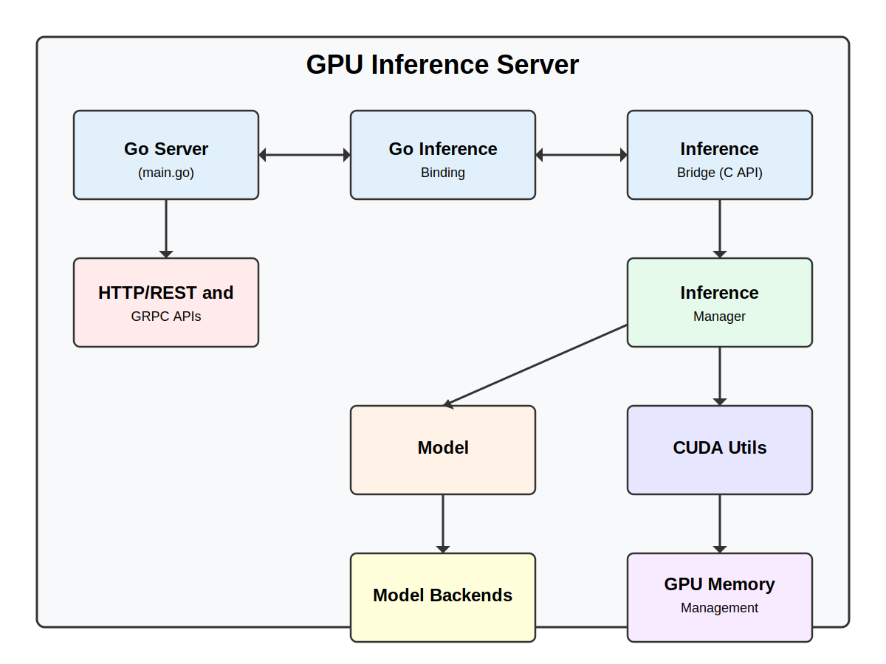

# 🚀 GPU AI Inference Server

## Overview

A high-performance, scalable GPU-accelerated AI inference server designed to efficiently load, manage, and execute machine learning models across NVIDIA GPUs. Built with modern C++, CUDA, and Go, this server provides a robust solution for deploying and serving machine learning models with low-latency inference.



## 🌟 Key Features

- **Multi-Framework Support**: 
  - ONNX Runtime integration
  - Extensible architecture for TensorFlow, TensorRT, PyTorch, and custom models
  - Seamless GPU acceleration

- **Advanced Model Management**:
  - Dynamic model loading and unloading
  - Version-based model handling
  - Comprehensive model metadata tracking

- **Performance Monitoring**:
  - Real-time inference statistics
  - GPU memory usage tracking
  - Detailed performance metrics

- **Flexible Deployment**:
  - REST and gRPC API support
  - Cloud-ready design
  - Easy integration with existing ML workflows

## 🔧 Technology Stack

- **Languages**: C++, Go, CUDA
- **GPU Acceleration**: NVIDIA CUDA
- **Model Frameworks**: 
  - ONNX Runtime
  - (Planned) TensorFlow, TensorRT, PyTorch
- **API**: 
  - REST (Gin Framework)
  - gRPC support (Planned)

## 📦 Quick Start

### Prerequisites

- NVIDIA GPU with CUDA support
- Go 1.23+
- CUDA Toolkit
- ONNX Runtime

### Installation

```bash
# Clone the repository
git clone https://github.com/Oscar-W-Chen/gpu-ai-inference-server.git
cd gpu-ai-inference-server

# Build the server
./scripts/build_server.py

# Run the server
./scripts/run_server.sh
```

## 🔍 API Documentation

Comprehensive API documentation is available in [docs/api.md](docs/api.md)

### Example API Endpoints

- `GET /health`: Server health check
- `GET /cuda`: CUDA device information
- `GET /models`: List available models
- `POST /models/{name}/load`: Load a specific model
- `POST /models/{name}/infer`: Run inference on a model

## 🚀 Deployment Options

### Local Development
- Docker support (Planned)
- Google Colab
- Local GPU workstations

### Cloud Platforms
- Google Cloud Platform
- AWS EC2 with GPU instances
- Azure GPU VMs

## 🛠 Build and Test

```bash
# Build inference engine
./scripts/build_inference_engine.sh

# Run CUDA tests
./build/test/cuda_test

# Run ONNX model tests
./build/test/onnx_test
```

## 📊 Performance Metrics

- Low-latency inference
- Efficient GPU memory management
- Horizontal scalability

## 🧩 Roadmap

 - [x] Fully implement ModelRepository and integrate it with the code stack
 - [x] Fully implement the model specific loading, inferencing, and unloading logic for ONNX
 - [x] Put API.md on homepage
 - [x] Restructure main.go to use singleton inference manager throughout the server session 
 - [x] Remove unnecessary DEBUG messages
 - [x] Put complete model files under /model directory to test loading functions
 - [ ] Run full end-to-end integration test on AI inferencing on top of GPUs

## 🤝 Contributing

1. Fork the repository
2. Create your feature branch (`git checkout -b feature/amazing-feature`)
3. Commit your changes (`git commit -m 'Add some amazing feature'`)
4. Push to the branch (`git push origin feature/amazing-feature`)
5. Open a Pull Request

## 📄 License

Distributed under the MIT License. See `LICENSE` for more information.

## 📞 Contact

Oscar Chen - [@Oscar-W-Chen](https://github.com/Oscar-W-Chen)

Project Link: [https://github.com/Oscar-W-Chen/gpu-ai-inference-server](https://github.com/Oscar-W-Chen/gpu-ai-inference-server)

## 🙏 Acknowledgements

- [NVIDIA Triton Inference Server](https://developer.nvidia.com/triton-inference-server)
- [ONNX Runtime](https://onnxruntime.ai/)
- Open-source community

---

**Note**: This project is currently in active development. Contributions and feedback are welcome! 🌈